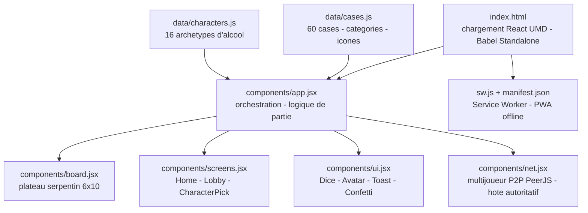

# GlouGlou!

[](https://github.com/Adam-Blf/GlouGlou/releases)

<!-- adam-badges:start -->
[](https://github.com/Adam-Blf/GlouGlou/commits) [](https://hits.sh/github.com/Adam-Blf/GlouGlou/) [](https://github.com/Adam-Blf/GlouGlou/commits) [](https://github.com/Adam-Blf/GlouGlou) [](LICENSE)
<!-- adam-badges:end -->


Le jeu de l'oie version apéro - 60 cases, 16 personnages, dé animé, système de code pour rejoindre une partie, installable en PWA.

**Live** - https://glouglou-mu.vercel.app

## Architecture



## Stack

- HTML + CSS pur (design system custom, palette néon)
- React 18 via UMD + Babel Standalone (compilation JSX dans le navigateur)
- Service Worker pour le fonctionnement offline
- Manifest PWA - installable iOS / Android / desktop

## Lancer en local

```bash
npm run dev
# puis ouvrir http://localhost:5173
```

> Un serveur statique HTTP est requis (le service worker ne marche pas en `file://`).

## Déploiement

Déployé sur Vercel en tant que site statique - aucun build, tout est servi tel quel.

```bash
vercel --prod
```

## Structure

```
index.html              # entrée + chargement React/Babel/SW
styles.css              # design system complet
manifest.json           # PWA manifest
sw.js                   # service worker (cache-first, offline)
icons/icon.svg          # icône vectorielle
data/
  cases.js              # 60 cases avec catégories/icônes/descriptions
  characters.js         # 16 archétypes d'alcool
components/
  ui.jsx                # Dice, Avatar, Toast, Confetti, GenderSelector
  net.jsx               # multijoueur PeerJS (host/guest, broker public)
  screens.jsx           # Home, Lobby, CharacterPick
  extra_screens.jsx     # Rules, HostSetup, TurnIntro, modals, EndStats
  board.jsx             # plateau serpentin 6x10
  app.jsx               # orchestration + logique de partie
```

## Gameplay

- Chaque case appartient à une catégorie (boire, donner, rôle, action, répit, spécial, tournée, ciblé).
- Cases spéciales chaînées - 39 → 33, 50 → -1, 53 → -3, 56 → téléport avant, 57 → téléport joueur.
- Rôles persistants - Roi des questions, Reine, Valet des pouces.
- Les bots jouent automatiquement pour tester le flow complet.

## Multijoueur

- P2P via [PeerJS](https://peerjs.com) - broker public, aucun backend requis.
- L'hôte crée la partie et obtient un code à 6 caractères. Les joueurs tapent ce code pour rejoindre.
- L'hôte est autoritatif - il applique les actions (dé, cases, modals) et re-broadcaste l'état complet à tous.
- Les guests envoient des actions RPC (`rollDice`, `closeModal`, `pickCupidon`, `giveSips`).
- Chacun ne peut agir que sur son propre tour / ses propres modals.

## Question homme/femme

À l'écran de choix de perso, chaque joueur déclare `homme` (🍌) ou `femme` (🍑). Les cases 19/44 ciblent les hommes, les cases 29/46 ciblent les femmes.

## À faire

- Jokers utilisables depuis l'UI en cours de tour
- Reconnexion guest après perte de connexion
- Host migration si l'hôte quitte

---

<p align="center">
  <sub>Par <a href="https://adam.beloucif.com">Adam Beloucif</a> - Data Engineer & Fullstack Developer - <a href="https://github.com/Adam-Blf">GitHub</a> - <a href="https://www.linkedin.com/in/adambeloucif/">LinkedIn</a></sub>
</p>


## Star History

<a href="https://www.star-history.com/?repos=Adam-Blf%2FGlouGlou&type=date&legend=top-left">
 <picture>
   <source media="(prefers-color-scheme: dark)" srcset="https://api.star-history.com/chart?repos=Adam-Blf/GlouGlou&type=date&theme=dark&legend=top-left" />
   <source media="(prefers-color-scheme: light)" srcset="https://api.star-history.com/chart?repos=Adam-Blf/GlouGlou&type=date&legend=top-left" />
   
 </picture>
</a>
